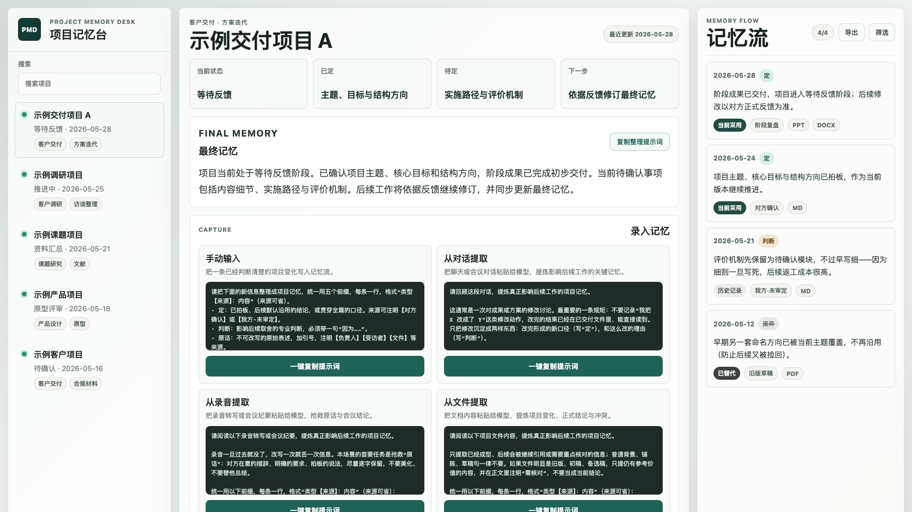

# Project Memory Desk

中文名：项目记忆台

一个本地优先的项目记忆工作台，用于把项目过程信息沉淀为持续更新的最终记忆。

Project Memory Desk 是一个本地优先的项目记忆工作台。它帮助用户把项目过程中的零散信息沉淀为两层结构：右侧的“记忆流”保留过程痕迹，中间的“最终记忆”呈现当前可采用版本。它适合教育咨询、课题研究、产品设计、客户项目、科研项目、法律与合规材料等需要长期推进、多次沟通、多版文件、多轮决策的工作场景。



## 为什么做这个项目

在长期推进学校文化、课程体系、课题研究和方案交付时，资料经常分散在聊天、会议、录音、文件夹、PPT、Word 和多轮修改稿中。项目真正困难的地方并非保存更多资料，而是随时知道当前采用什么、哪些内容已被确认、哪些判断已被替代、下一步应该做什么。因此需要一个围绕“最终记忆”和“记忆流”组织项目上下文的本地优先工具。

## 当前版本功能

- 项目列表
- 最终记忆
- 记忆流
- 相关文件 chips
- 提示词一键复制
- 手动录入记忆
- 匿名 demo 数据
- 本地运行

## 本地运行

```bash
npm install
npm run dev
```

构建检查：

```bash
npm run build
```

## 数据结构

当前 demo 数据位于 `data/`：

- `data/demo-projects.json`
- `data/demo-memory-flow.json`
- `data/demo-prompts.json`

每条记忆包含 `id`、`projectId`、`date`、`type`、`content`、`status`、`source`、`relatedFiles`、`createdAt`、`updatedAt`。每个项目包含 `id`、`name`、`status`、`tags`、`lastUpdated`、`finalMemory`、`summary`、`memoryFlowIds`。

## 与其他产品的区别

| 产品类型 | 数据是否本地优先 | 是否强调最终记忆 | 是否保留过程流 | 是否适合项目状态恢复 | 是否支持文件关联 | 是否面向交付型项目 | AI 自动化方向 |
| --- | --- | --- | --- | --- | --- | --- | --- |
| Obsidian | 是 | 依赖用户组织 | 可通过链接实现 | 中等 | 强 | 通用笔记 | 插件生态 |
| Notion | 否 | 依赖模板 | 可通过数据库实现 | 中等 | 强 | 通用协作 | 云端 AI |
| Mem | 否 | 弱 | 弱 | 中等 | 中 | 个人知识 | 云端 AI |
| Tana | 否 | 依赖结构设计 | 强 | 中等 | 中 | 知识图谱 | 结构化 AI |
| Linear | 否 | 面向任务状态 | 保留 issue 轨迹 | 强 | 中 | 产品研发 | 工作流自动化 |
| 普通文件夹 | 可本地 | 弱 | 弱 | 弱 | 强 | 依赖命名习惯 | 无 |
| Project Memory Desk | 是 | 强 | 强 | 强 | 计划增强 | 强 | 从半自动提示词到本地或自带 API |

## 本地优先优势

- 用户数据默认留在本地。
- 真实项目资料无需上传到第三方服务。
- 适合敏感项目和长期资料沉淀。
- 数据可导出、可迁移、可备份。
- 未来可选择接入本地模型或用户自己的 API key。

## 隐私说明

开源仓库不包含真实项目数据，demo 数据均为匿名模拟。用户应避免把真实客户资料提交到公开仓库，并建议将真实 workspace、private、uploads、recordings、exports 等目录放入 `.gitignore`。

## 未来计划

- 本地文件索引
- 从记忆流自动生成最终记忆
- 冲突识别与已替代标记
- 本地模型或 API 模型接入
- 多模型路由
- Docker 部署
- 桌面端打包
- 手机局域网访问
- GitHub 私有仓库同步
- Obsidian 或 Markdown vault 导出

## 文档

- [架构说明](docs/architecture.md)
- [数据模型](docs/data-model.md)
- [提示词模板](docs/prompts.md)
- [路线图](docs/roadmap.md)
- [隐私说明](docs/privacy.md)
- [产品对比](docs/comparison.md)

## 许可证

MIT License
